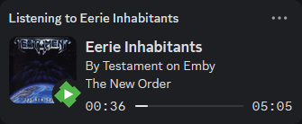
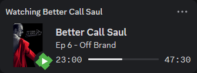
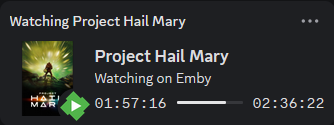
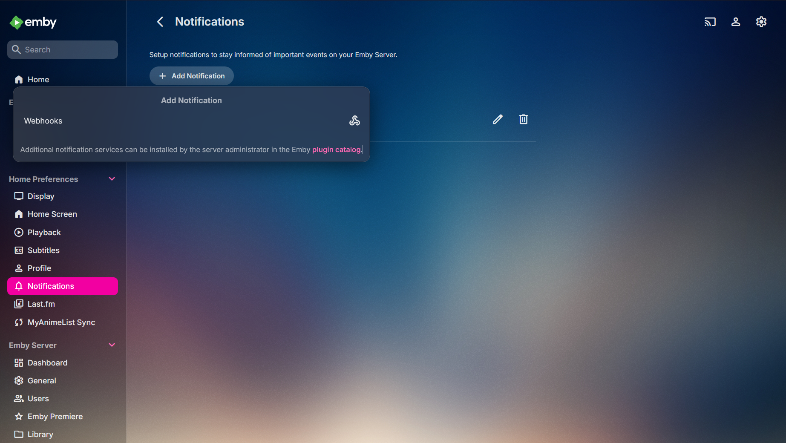
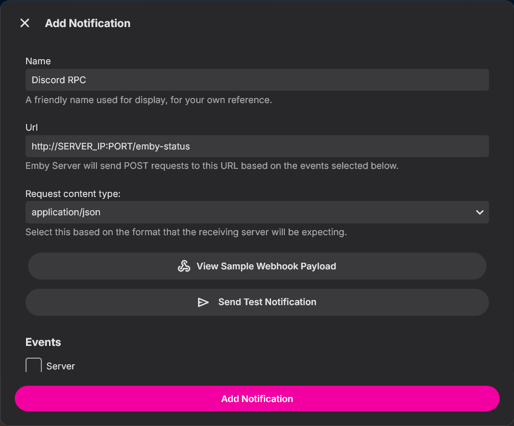
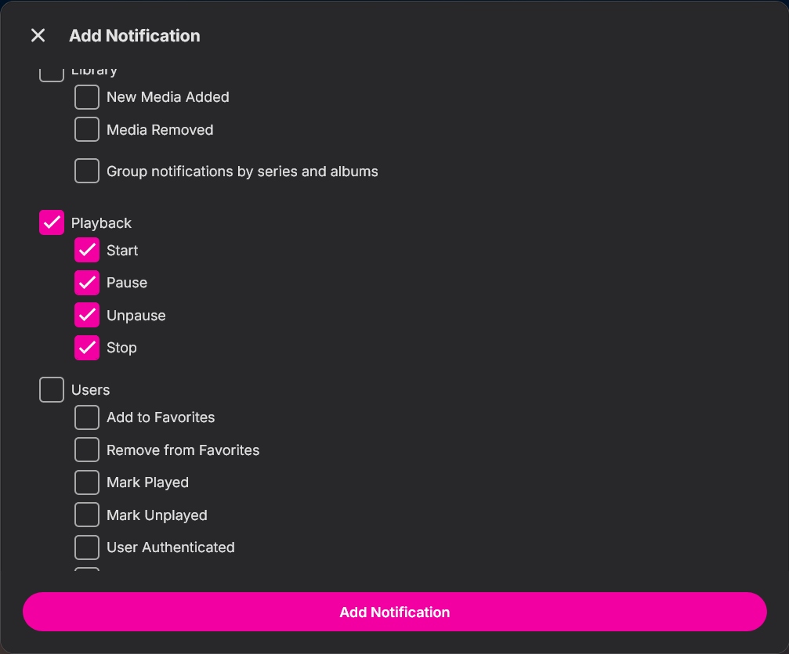
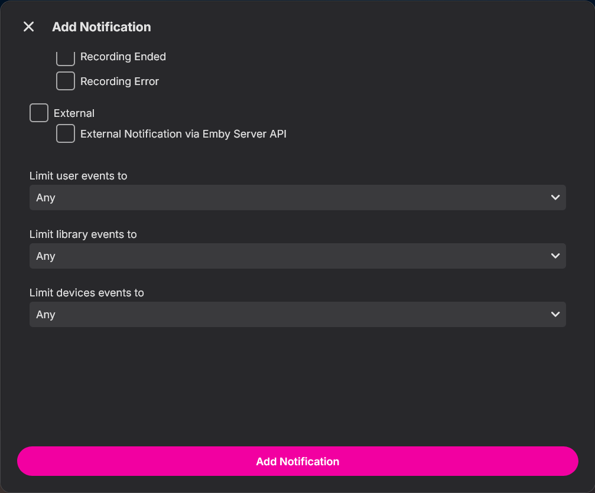
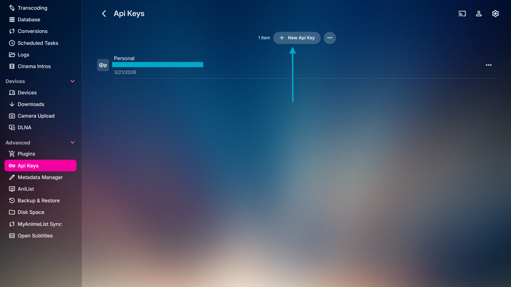

# Emby-RPC

> [!CAUTION]
> **USE AT YOUR OWN RISK**: This is a self-botting script, which is **STRICTLY AGAINST** Discord's ToS. This may lead to your account being suspended or outright terminated. Also, **NEVER SHARE** your personal user token with anyone.

> [!WARNING]
> If your account gets suspended or terminated, it is not my responsibility.

This is a Discord Rich Presence Client for Emby. It automatically displays exactly what you're watching (or listening to) on your personal Discord profile using Rich Presence. This script is for headless environments, where your Emby server is located.

Most Rich Presence tools rely on local Inter-Process Communication, meaning they only work if you are watching media on the exact same device that Discord is running on which falls apart the moment you switch to watching Emby on your living room TV or your mobile phone. This script solves that problem entirely by moving the logic to the server, listening directly to Emby's global webhooks, parsing your playback events, and updating your Discord profile from the background using a Personal User Token so that no matter what device you are watching on, your Discord status stays in sync. (**NOTE: I will not explain how to extract your Discord Personal Token here, albeit there are guides online**).

If you would rather not risk it, and use a safer alternative: https://github.com/xyxxyxxy/exy

---
## Previews:

1. Music:



2. TV Shows:



3. Movies:


## Configuration

To make this work, you need to connect your Discord Application and your Emby Webhook.
### 1. Discord Developer Portal
1. Go to the [Discord Developer Portal](https://discord.com/developers/applications).
2. Create a "New Application" (Name it "Emby", or whatever you want the bold text to say on your Discord profile).
3. Copy the **Application ID**.
4. You do **not** need a bot token. This script uses a User Token to update your personal status. *(Again, never share your User Token with anyone)*.

### 2. Emby Webhook Setup
This script listens for Emby Webhook events to trigger instant updates. Follow the image guides below:

1. **Navigate to Webhooks:** In your Emby Settings Dashboard, go to **Plugins > Webhooks** and click **Add Webhook**.


2. **Setup URL & Events:** Set the **Webhook URL** to `http://localhost:8068/emby-status` *(Change the **PORT** if you customized it during setup)*.


3. **Select Trigger Events:** Make sure you select these playback events so the Discord status updates instantly when you pause, play, or stop.


4. Lastly, if you have multiple users on your Emby server, select the dropdown for "Limit user events to", and select only your user.    

### 3. Emby API Key:
This is crucial if you want to display your Music Album Posters/TV Show Posters/Movie Posters. Go to the settings again in Emby -> Advanced -> API Keys, and create a new API key or use your existing one.


A few more things to watch out for:

1. If you're running Emby inside a docker or a separate machine, adding "http://localhost:PORT/emby-status" in the webhook settings won't work. You need the actual IP of the server.
2. Additionally, you may want to (safely) open port 8068 (or whatever port you decide to use) in your firewall, so Emby can reach this script. 

---

## Installation

1. **Clone the repository:**
   ```bash
   git clone https://github.com/lxBlazarxl/Emby-RPC-for-Discord.git
   cd emby-rpc
   ```

2. **Run the Installer:**
	```bash
   sudo ./install.sh
	```

   The installer will automatically:
   - Install all required `npm` dependencies.
   - Create and enable a background `systemd` service.
   - Launch a CLI wizard to capture your credentials.

> **Note:** You can run `./setup.sh` at any time in the future to change your credentials without re-installing.

3. **Uninstallation**: If you want to uninstall the script, the uninstaller removes the systemd daemon cleanly.
	```bash
	sudo ./uninstall.sh
	```

---
